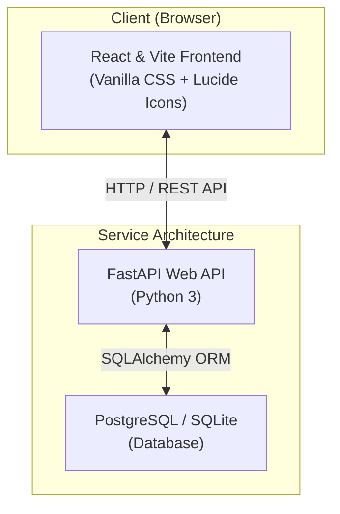

# IM-System: Smart Inventory & Order Console

A high-fidelity, containerized full-stack application designed for businesses to manage products, customers, and sale invoices efficiently. Built using modern software engineering principles, this repository features transactional safety, real-time analytics, and a polished responsive mobile-first UI.

---

## 🏗️ Technical Stack Architecture

The system utilizes a modern, robust, and asynchronous architecture with three main services:



- **Frontend**: **React** (scaffolded via **Vite**) styled with a beautiful premium dark/light glassmorphism design system. Features real-time stat cards, responsive lists, inline validations, and dynamic multi-item invoice building.
- **Backend API**: **Python FastAPI** providing robust OpenAPI self-documentation, schema verification via **Pydantic**, and persistent database operations via **SQLAlchemy**.
- **Database**: Supports **PostgreSQL** or **SQLite** with automatic table schema generation and automated mock data seeding.
- **Deployment**: Live hosted on **Vercel** (Frontend) and **Render** (Backend).

---

## ✨ Key Features

1. **Dashboard Analytics**: Glowing interactive charts and summary cards displaying total revenue, unique products cataloged, active client directories, and purchase volume.
2. **Low-Stock Alerts**: Immediate warning list alerting operators to products with low stock levels, featuring visual neon percentage indicators.
3. **Multi-Item Invoice Building**: An advanced sale modal enabling users to select a customer and compile multiple products with varying quantities, recalculating subtotals in real-time.
4. **Strict Transaction Safety**: Orders are validated atomically:
   - Verifies customer existence.
   - Verifies product records exist.
   - Checks stock bounds. If any product is insufficient, the transaction rolls back, throwing a `400 Bad Request` API error.
   - Updates stock count and aggregates order amounts automatically on successful placement.
5. **Auto-Seeding Database**: The backend includes an automated network seeder that initializes the database with mock products, customers, and orders if it detects an empty state.
6. **Mobile-First Responsive Design**: Includes a hamburger navigation menu, theme toggle, and fluid layouts for all device sizes.

---

## 📂 Repository Structure

```text
inventory-order-management-system/
├── backend/
│   ├── app/
│   │   ├── config.py         # Environment configuration
│   │   ├── database.py       # DB engine, session maker
│   │   ├── models.py         # SQLAlchemy ORM models
│   │   ├── schemas.py        # Pydantic validation schemas
│   │   ├── crud.py           # Database transaction handling
│   │   ├── main.py           # FastAPI entrypoint & CORS
│   │   └── routers/          # Modular API endpoints
│   └── requirements.txt      # Python dependencies
├── frontend/
│   ├── src/
│   │   ├── assets/           # Client assets & SVG icons
│   │   ├── components/       # Reusable UI elements
│   │   ├── api.js            # Axios/Fetch API request wrapper
│   │   ├── index.css         # Themed glassmorphic design system
│   │   ├── App.jsx           # Main React Dashboard container
│   │   └── main.jsx          # DOM rendering entrypoint
│   ├── index.html            # SPA main HTML page
│   ├── package.json          # Node dependency mappings
│   └── vite.config.js        # Vite build configuration
└── README.md                 # Project documentation
```

---

## 🚀 Getting Started: Local Development

### 1. Backend Setup (FastAPI)
1. Navigate to the backend folder and create a virtual environment:
   ```bash
   cd backend
   python -m venv venv
   source venv/bin/activate  # On Windows: venv\Scripts\activate
   ```
2. Install Python packages:
   ```bash
   pip install -r requirements.txt
   ```
3. Start the local server (it will automatically create an SQLite database if PostgreSQL is not configured):
   ```bash
   uvicorn app.main:app --reload
   ```
   *API Documentation will be available at `http://localhost:8000/docs`*

### 2. Frontend Setup (React/Vite)
1. Open a new terminal, navigate to the frontend folder:
   ```bash
   cd frontend
   ```
2. Install Node packages:
   ```bash
   npm install
   ```
3. Start the local development server:
   ```bash
   npm run dev
   ```
   *Open `http://localhost:5173` to view the application.*

---

## 👨‍💻 Author

**Sairaj Naikwade**
*Built following modern enterprise guidelines for robust full-stack applications.*
