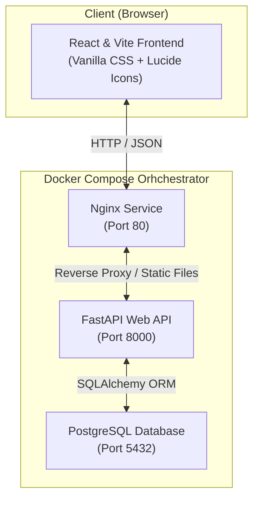

# IM-System: Production-Ready Inventory & Order Management System

A high-fidelity, containerized full-stack application designed for businesses to manage products, customers, and sale invoices. Built using a modern technical assessment standard, this repository illustrates clean software engineering principles, transactional safety, and polished visual aesthetics suitable for a Software Engineer at a high-paced AI startup.

---

## Technical Stack Architecture

The system utilizes a modern, robust, and asynchronous architecture with three main container services:



- **Frontend**: **React** (scaffolded via **Vite**) styled with a beautiful premium dark glassmorphism design system. Complete with real-time stat cards, responsive lists, inline validations, and dynamic multi-item invoice building with live pricing.
- **Backend API**: **Python FastAPI** providing robust OpenAPI self-documentation, schemas verification via **Pydantic**, and persistent database operations via **SQLAlchemy**.
- **Database**: **PostgreSQL 16** with automatic table schemas generation and named volume data persistence.
- **Orchestration**: Fully dockerized and managed with a unified **Docker Compose** configuration including healthcheck synchronizations.

---

## Key Features

1. **Dashboard Analytics**: Glowing interactive charts and summary cards displaying total revenue, unique products cataloged, active client directories, and purchase volume.
2. **Low-Stock Alarm**: Immediate warning list alerting operators to products with stocks $\le 10$ with visual neon percentage indicators.
3. **Multi-Item Invoice Building**: An advanced sale modal enabling users to select a customer and compile multiple products with varying quantities, recalculating subtotals in real-time.
4. **Strict Transaction Safety**: Orders are validated atomically:
   - Verifies customer existence.
   - Verifies product records exist.
   - Checks stock bounds. If any product is insufficient, the transaction rolls back, throwing a `400 Bad Request` API error.
   - Updates stock count and aggregates order amounts automatically on successful placement.
5. **Cascading Cancel & Stock Reclaim**: Deleting or cancelling a transaction automatically restores all line items back into product inventory.
6. **Integrity Enforcement**: Deleting products or customers currently linked to active purchase invoices is blocked to prevent broken historic invoices.

---

## Repository Structure

```
inventory-order-management-system/
├── backend/
│   ├── app/
│   │   ├── config.py         # Environmental configurations loader
│   │   ├── database.py       # DB engine, session maker, get_db dependency
│   │   ├── models.py         # SQLAlchemy ORM models
│   │   ├── schemas.py        # Pydantic validation schemas
│   │   ├── crud.py           # DB business transaction handling
│   │   ├── main.py           # FastAPI application entrypoint & CORS
│   │   └── routers/          # Modular API endpoint routers
│   ├── Dockerfile
│   ├── .dockerignore
│   └── requirements.txt
├── frontend/
│   ├── src/
│   │   ├── assets/           # Client assets
│   │   ├── components/       # UI elements
│   │   ├── api.js            # Axios/Fetch API request wrapper
│   │   ├── index.css         # Dark theme glassmorphic design system CSS
│   │   ├── App.jsx           # Main React Dashboard container
│   │   └── main.jsx          # DOM rendering entrypoint
│   ├── index.html            # SPA main HTML page
│   ├── nginx.conf            # High-performance Nginx hosting block
│   ├── package.json          # Node dependency mappings
│   ├── vite.config.js
│   ├── .dockerignore
│   └── Dockerfile
├── docker-compose.yml        # Services orchestrator config
├── .env                      # Global environmental settings (ignored in git)
├── README.md                 # Primary system manual
└── DEPLOYMENT.md             # Production hosting guidelines
```

---

## Getting Started: Local Docker Compose (Mandatory Setup)

The easiest, production-ready way to launch the entire stack is using Docker Compose.

### Prerequisites
- [Docker Desktop](https://www.docker.com/products/docker-desktop/) installed and running.

### Quick Start
1. Clone this repository to your system:
   ```bash
   git clone <repository-link>
   cd inventory-order-management-system
   ```

2. Review or update the global environment parameters in `.env` in the root folder:
   ```env
   POSTGRES_USER=inventory_admin
   POSTGRES_PASSWORD=postgres_secure_pass_123
   POSTGRES_DB=inventory_db
   POSTGRES_HOST=db
   POSTGRES_PORT=5432
   VITE_API_URL=http://localhost:8000/api/v1
   ```

3. Spin up the entire multi-container service:
   ```bash
   docker compose up --build
   ```

4. Once the build completes and services are healthy:
   - **React Frontend**: Open `http://localhost` (standard HTTP port 80) in your web browser.
   - **FastAPI Documentation**: View interactive Swagger endpoints at `http://localhost:8000/docs`.
   - **PostgreSQL Database**: Port `5432` is exposed for local management.

---

## Alternative Setup: Local Manual Development

If running outside Docker containers:

### 1. Backend Setup
1. Move to backend folder and create virtual environment:
   ```bash
   cd backend
   python -m venv venv
   source venv/bin/activate  # On Windows: venv\Scripts\activate
   ```
2. Install packages:
   ```bash
   pip install -r requirements.txt
   ```
3. Set local environment variables (make sure PostgreSQL server is running locally) or let SQLAlchemy create an SQLite database if configured. Run the server:
   ```bash
   uvicorn app.main:app --reload
   ```

### 2. Frontend Setup
1. Move to frontend folder:
   ```bash
   cd ../frontend
   ```
2. Install Node packages:
   ```bash
   npm install
   ```
3. Start local development server with Hot Module Replacement (HMR):
   ```bash
   npm run dev
   ```
   Open `http://localhost:5173` to test.

---

## Author
**Software Engineer & DevOps Architect Assessment**
*Suite built following rigorous enterprise guidelines for high-performing startup integrations.*
